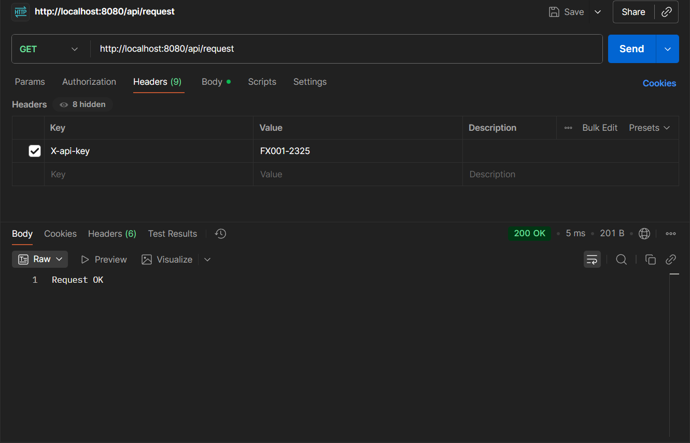
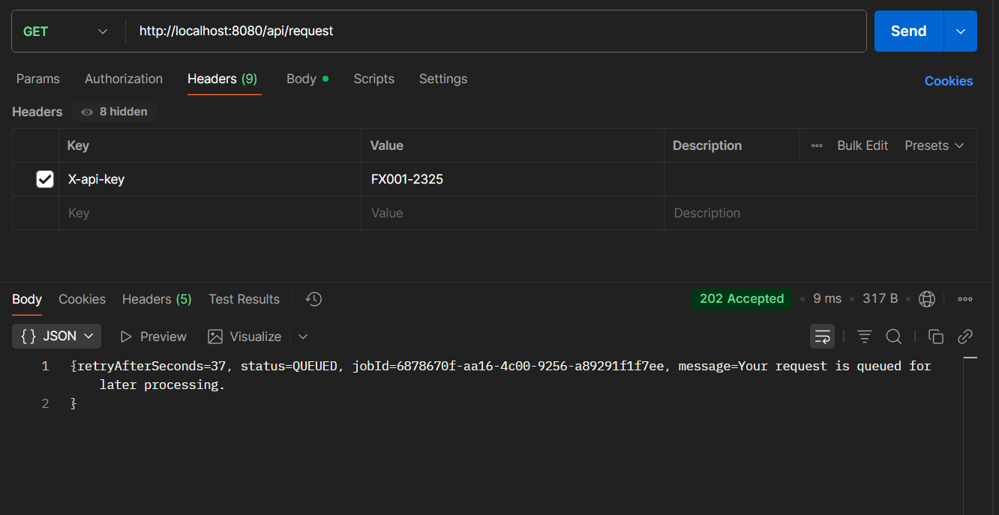
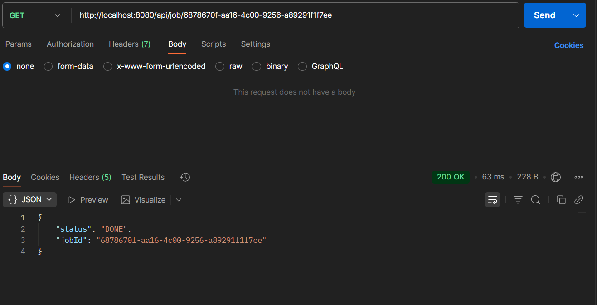

# Token_Bucket_Algorithms_demo

Mô tả workflow:

Client gửi request tới server kèm một ApiKey trong header tương ứng với phân khúc client: 
"FX001-...." - FREE 20 requests/hour
"BX001-...." - BASIC 60 requests/hour
"PX001-...." - PROFESSOR 100 requests/hour

# Case 1: Client còn đủ Token --> Xử lý bình thường kèm một trường trong Response-Header về số Token còn lại

# Case 2 Client hết Token --> Queueing đến khi token refill lại thì xử lý

1. Đọc ApiKey phát hiện hết Token --> Đưa vào Queue, response cho khách hàng đã nhận request.

- Request trong Queue sẽ gắn với một JobID
- retryAfterSeconds: thời gian chờ để Token hồi lại 
- Khi request ra khỏi Queue server sẽ xử lý request và lưu lại kết quả vào Cache. 
- Nhiệm vụ của phía client là hết thời gian retryAfterSeconds sẽ timout và request lại tới server để lấy kết quả. Lúc này server chỉ việc lấy ra kết quả từ Cache với tốc độ rất nhanh
- Về việc timeout và request lại server, client có thể sử dụng một số chiến lược như: Fixed interval polling, Exponential Backoff, Adaptive Polling... Tuy nhiên vì hạn chế demo nhỏ đơn giản không có Frontend chúng ta sẽ tạm thời demo bằng tay

2. Client request lại sau khi timeout 

